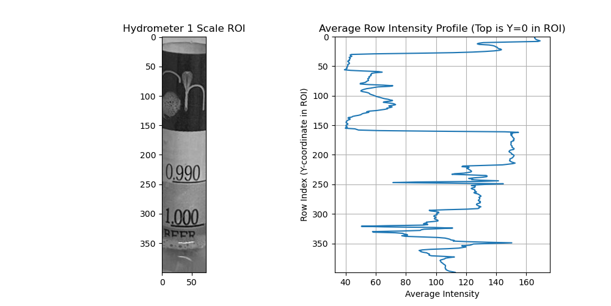
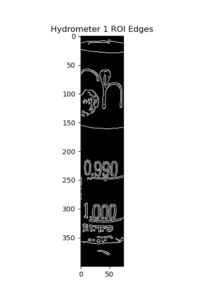
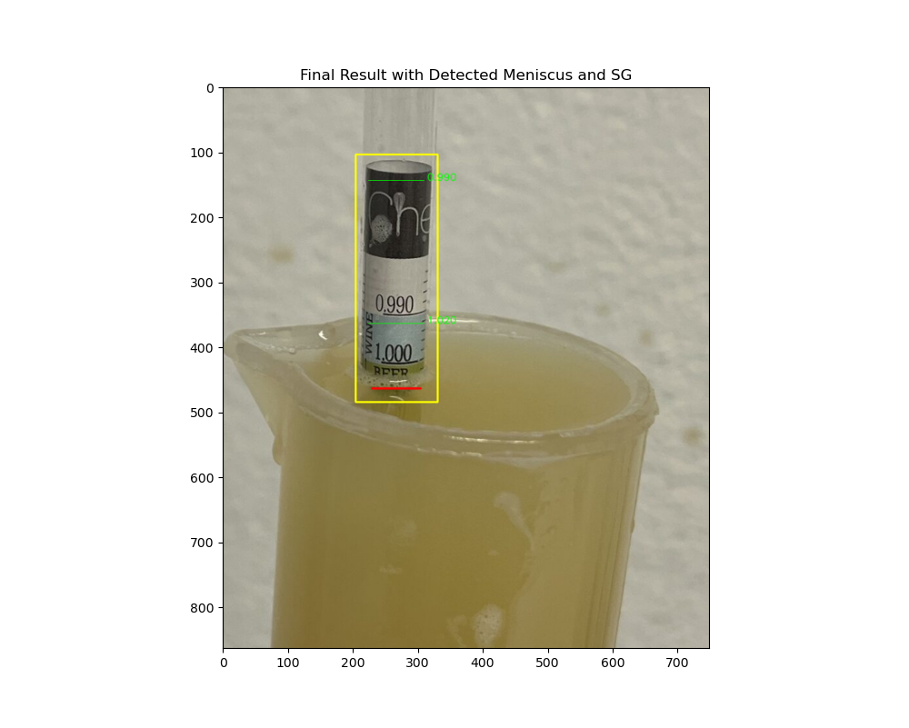

# cv-hydro
WIP to read specific gravity from images of hydrometers.

Currently, a hydrometer can (sometimes) be found in an image and the meniscus located.  Next is to properly calculate the gravity using the meniscus location compared against the line markings on the hydro.

Here are some examples of the output:

